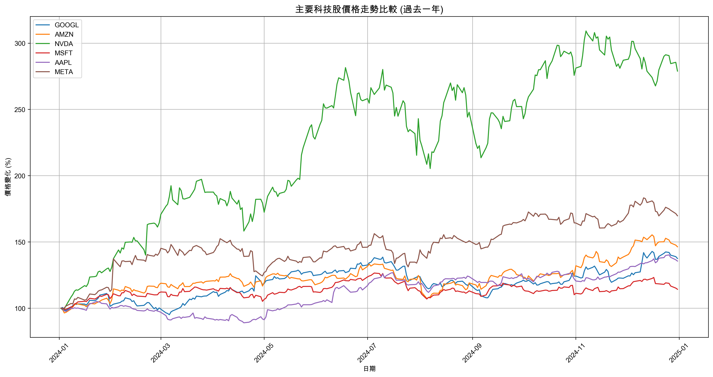
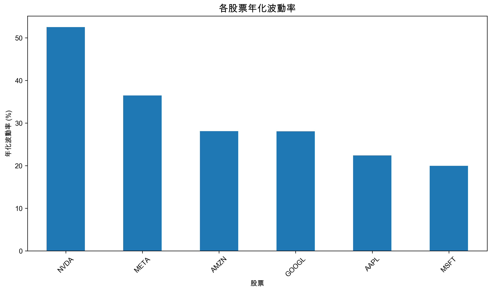
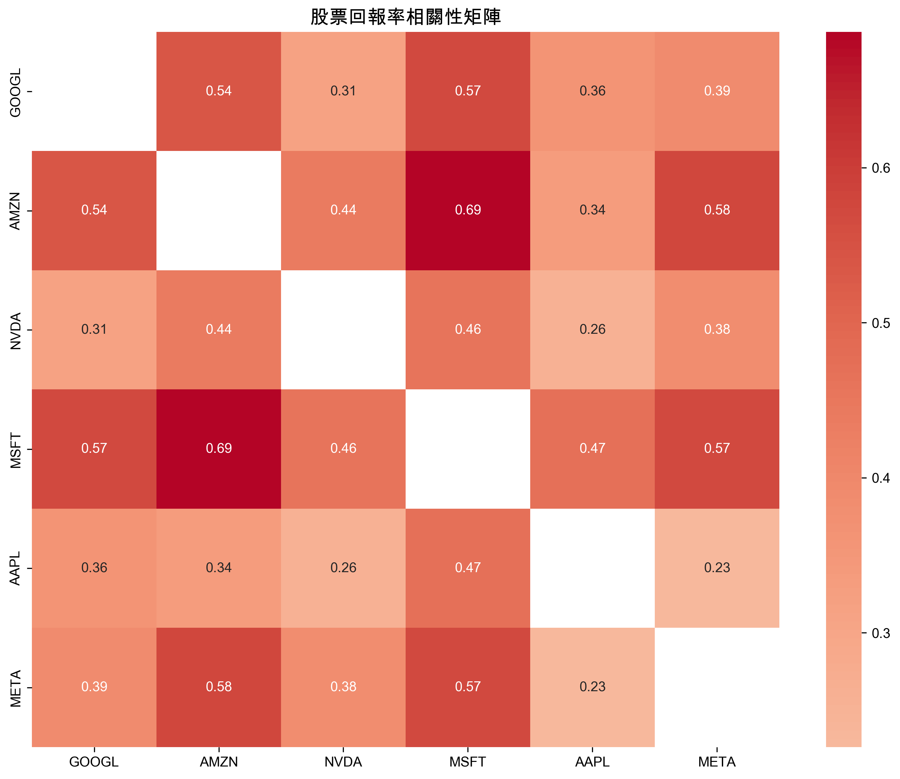

# 科技股票市場分析報告
## 更新時間：2025-01-01

### 1. 價格走勢分析

過去一年中，主要科技股的表現各有差異：

#### 年度收益率排名：
- NVDA: 178.9%
- META: 69.7%
- AMZN: 46.3%
- GOOGL: 37.5%
- AAPL: 35.6%
- MSFT: 14.3%

從價格走勢圖可以觀察到：
1. 表現最佳的股票是 NVDA，年度收益率達到 178.9%
2. 表現最差的股票是 MSFT，年度收益率為 14.3%

### 2. 風險分析

#### 波動率分析

各股票的年化波動率排名：
- NVDA: 52.5%
- META: 36.5%
- AMZN: 28.1%
- GOOGL: 28.1%
- AAPL: 22.4%
- MSFT: 20.0%

主要觀察：
1. NVDA 顯示最高波動率 (52.5%)，表示價格波動最大
2. MSFT 顯示最低波動率 (20.0%)，表示相對穩定

#### 相關性分析

從相關性熱圖中可以觀察到：
1. 最高相關性：AMZN 和 MSFT (相關係數: 0.69)
   - 這表示這兩支股票的價格走勢高度相關，可能受相似的市場因素影響
2. 最低相關性：AAPL 和 META (相關係數: 0.23)
   - 這兩支股票的價格走勢相關性最低，適合用於投資組合分散風險

### 3. 投資建議

基於上述分析，我們可以得出以下投資建議：

1. 高增長機會：
   - NVDA 和 META 在過去一年表現最佳，可能適合追求高報酬的投資者
   
2. 風險控制：
   - MSFT 波動率最低，適合風險規避型投資者
   - 建議將 AAPL 和 META 納入投資組合，以達到風險分散的效果

3. 投資組合建議：
   - 保守型投資者：以 MSFT 為主，搭配少量高成長股票
   - 積極型投資者：可以配置更多 NVDA 和 META，但需要承受較高波動風險
   - 平衡型投資者：綜合配置，並特別注意利用低相關性股票來分散風險
